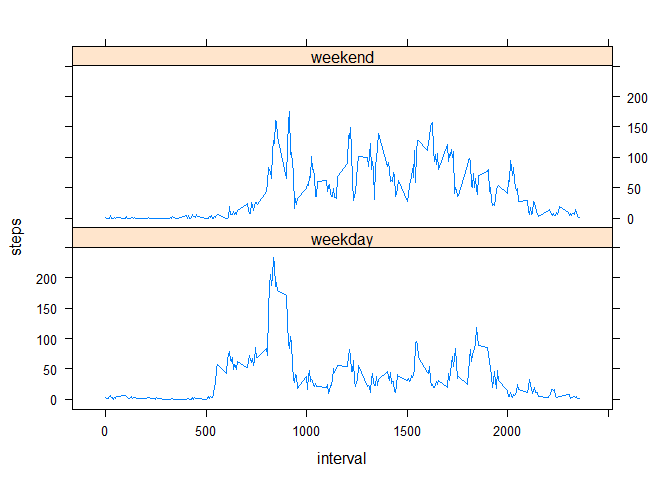

# Reproducible Research: Peer Assessment 1


## Loading and preprocessing the data
Unzip and load the data

```r
# Unzip the archive
unzip("activity.zip")

# Read the data in a data frame
data <- read.csv("activity.csv", header = TRUE, na.strings = "NA", stringsAsFactors = FALSE)
```
Convert the columns to the correct data type

```r
data$steps <- as.numeric(data$steps)
data$date <- as.Date(data$date)
data$interval <- as.numeric(data$interval)

# Display the first rows
head(data)
```

```
##   steps       date interval
## 1    NA 2012-10-01        0
## 2    NA 2012-10-01        5
## 3    NA 2012-10-01       10
## 4    NA 2012-10-01       15
## 5    NA 2012-10-01       20
## 6    NA 2012-10-01       25
```


## What is mean total number of steps taken per day?

```r
# Group days with tapply and calculate the sum of steps for each day
sumPerDay <- tapply(data$steps, data$date, sum, na.rm = TRUE)

# Calculate mean and median
meanPerDay <- mean(sumPerDay)
medianPerDay <- median(sumPerDay)
```
Histogram of steps taken per day

```r
hist(sumPerDay, breaks = 20, main = "Histogram of the total number of steps taken each day", xlab = "Steps per day")
abline(v = meanPerDay, col = "red")
abline(v = medianPerDay, col = "blue")
legend(x = "topright", legend = c("mean", "median"), col = c("red", "blue"), lty = 1)
```

 

The mean of steps per day is 9354.23 and the median of steps per day is 10395.

## What is the average daily activity pattern?

```r
# Calculate the mean per interval (use aggregate instead of tapply because it returs a data frame)
meanOfStepsPerInterval <- aggregate(steps ~ interval, data, mean)

# Plot calculated mean
plot(meanOfStepsPerInterval, type = "l", main = "Average number of steps per 5 minute interval", xlab = "5-minute interval", ylab = "Average number of steps taken")
```

 

```r
# Find the maximum average number of steps
maximumNoOfSteps <- meanOfStepsPerInterval[which.max(meanOfStepsPerInterval$steps), ]
```


```r
# Interval with the maximum number of steps
maximumNoOfSteps
```

```
##     interval steps
## 104      835   206
```

The maximum number of steps is 206.17 and is in interval number 835.


## Imputing missing values


```r
# Find rows where at least on value is missing
sum(!complete.cases(data))
```

```
## [1] 2304
```

Check which column contains NAs

```r
# Check column steps
anyNA(data$steps)
```

```
## [1] TRUE
```

```r
# Check column date
anyNA(data$Date)
```

```
## [1] FALSE
```

```r
# Check column interval
anyNA(data$interval)
```

```
## [1] FALSE
```

As we can see, only the column steps has missing values.

The strategy to imput the missing values is filling them with the mean of the interval from the other days.


```r
# copy data frame
data2 <- data

# Calculate the mean of steps per interval
meanOfStepsPerInterval <- aggregate(steps ~ interval, data, mean)

# Copy values where steps is NA
data2$steps <- ifelse(is.na(data2$steps), meanOfStepsPerInterval[data2$interval, "steps"], data2$steps)
```


```r
# Calculate the mean per interval (use aggregate instead of tapply because it returs a data frame)
aggregatedStepsPerDay <- aggregate(steps ~ date, data2, sum)

hist(aggregatedStepsPerDay$steps, breaks = 20, main = "Histogram of the sum of steps per day with imputed values", xlab = "Steps per day")

# Draw lines for mean and median
meanStepsPerDay <- mean(aggregatedStepsPerDay$steps)
abline(v = meanStepsPerDay, col = "red")
medianStepsPerDay <- median(aggregatedStepsPerDay$steps)
abline(v = medianStepsPerDay, col = "blue")
legend(x = "topright", legend = c("mean", "median"), col = c("red", "blue"), lty = 1)
```

 

The mean is 9545.51 and the median is 10395.


## Are there differences in activity patterns between weekdays and weekends?

```r
# Add a column weekday/weekend
data2$weekday <- factor(weekdays(data2$date) %in% c("Saturday", "Sunday") + 1L, levels = 1:2, labels = c("weekday", "weekend"))

# Panel plot comparing the patterns for weekday/weekend
meanOfStepsPerIntervalWeekday <- aggregate(steps ~ interval + weekday, data2, mean)

library(lattice)

xyplot(steps ~ interval | weekday, meanOfStepsPerIntervalWeekday, layout = c(1, 2), type = "l")
```

 

In the plots we can see that the person tends to get up earlier on weekdays and is more active during the day on weekends.


